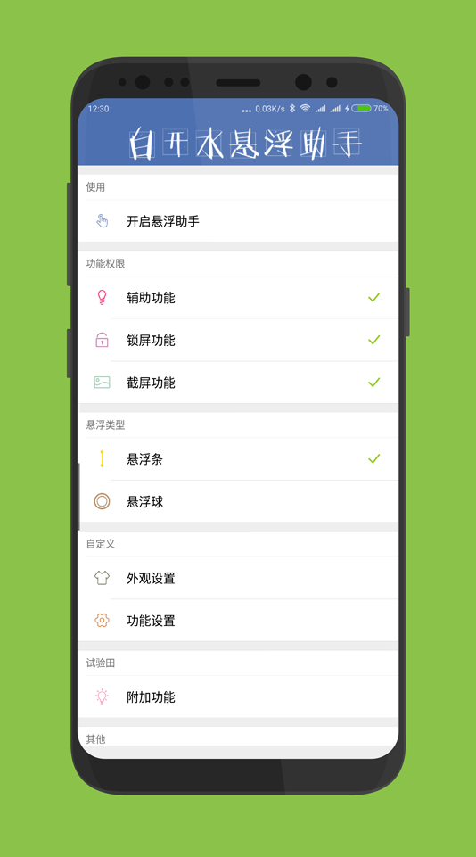
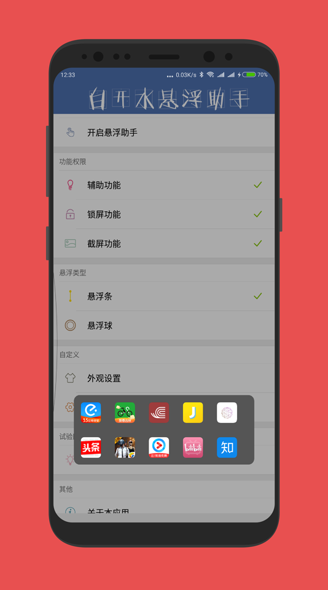
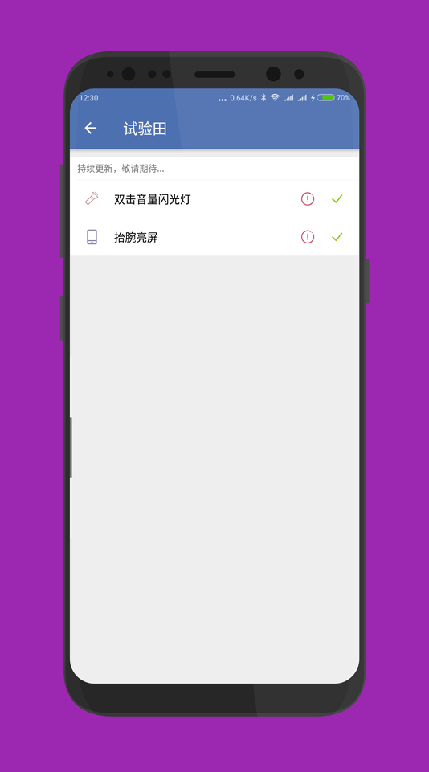
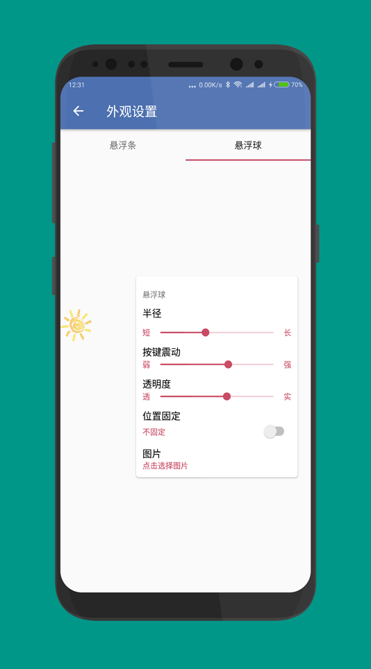

## 白开水悬浮助手是一款安卓高效率操作工具

用来解决当下随着手机屏幕有越来越大，单手操作也越来越困恼的问题；

**便捷的单手操作**: 左右切换，单手无忧；

**个性化的外观**: 自定义外观，选择自己喜欢的样子；

**个性化的功能**: 自定义功能，选择自己熟悉的操作方式；

> 其实就是买了MIX2然后发现单手操作很困难，看了一下市面上的悬浮工具都不太满意，所以自己动手做一个自己需要的；

**强迫症患者的需求：**

- 单击返回才是最完美的；

- 三大金刚键的功能必须是一步操作就可以完成的；

- 必须是可以自定义背景的；

---
 
### 有任何使用问题或建议,欢迎加入QQ交流群：
[白开水悬浮助手]694193470

## 更新日志

### 1.2
1.修复自定义悬浮球背景时出现设置不成功或闪退的bug；

2.修复了在横屏的时候出现悬浮条/悬浮球位置异常的bug；

3.修复了部分机型在首次开启悬浮条/悬浮球出现闪退的bug；

4.修复了功能设置界面，在切换菜单数量后子菜单功能显示异常bug；

5.修复了悬浮条外观自定义界面出现悬浮条点击功能异常bug；

### 1.5
1.优化并使用了全新的菜单详情交互方式；

2.修复了设置快捷APP菜单时出现的异常退出问题；

3.加入了截屏功能嘻嘻；

4.修复了悬浮球显示异常；

5.加入了全新的悬浮条隐藏主题样式，让悬浮条看起来更加不起眼；

6.悬浮球在你不使用的时候会自己躲起来了；

7.当你使用输入法的时候，悬浮球会自动弹起来，而悬浮条，会懂事的
躲起来；

### 1.6
1.修复了悬浮条隐藏式主题左右切换时出现主题异常切换bug；

2.修复悬浮条震动设置保存无效bug；

3.更新了图标

### 2.0
1.获得了全新的UI界面；

2.将软键盘弹出时悬浮球避开动作修改为隐藏；

3.新增了更新内容提示窗；

4.新增了简单的新手指引；

5.新增了悬浮助手位置固定功能；

6.新增了暂时隐藏悬浮助手功能；

7.新增了进入应用界面功能；

### 2.1
1.加入试验田模块；

2.加入双击音量打开手电功能；

3.加入抬腕亮屏功能；

[点击进入下载页面](https://www.coolapk.com/apk/com.skkk.easytouch)
